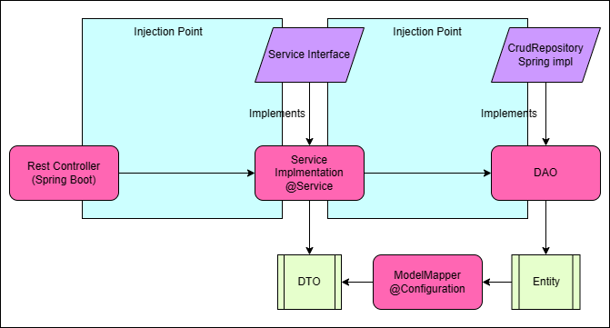

# SmartJob
<div align="center">
<p align="left">
   
</p>

</div>

Este repositorio contiene el código fuente de una API REST desarrollada en Java utilizando SpringBoot, SpringData, Lombok, ModelMapper, y MySQL. Esta API es parte de la aplicación TuHome.

## Dependencias utilizadas
- Java 19
- SpringBoot 3.03
- SpringData
- Lombok
- ModelMapper
- H12
- Maven

## Descarga y configuración
Para descargar este repositorio, puedes clonarlo desde la terminal utilizando el siguiente comando:
```bash
git clone https://github.com/ammoraleso/smart-job.git
```
Una vez que tengas el repositorio en tu máquina local, puedes importarlo en tu IDE de preferencia (por ejemplo, IntelliJ IDEA o Eclipse) como un proyecto Maven.

La base de datos H2 se creará una vez se ejecute el proyecto y su consola esta aqui:
```bash
http://localhost:8080/h2-console/login.do
```

```properties  

spring.datasource.username=admin
spring.datasource.password=admin

```
## Documentacion Swagger

Se pueden ver los endpoints construidos en esta api en la siguiente URL:
http://localhost:8080/swagger-ui/index.html#/

## Postman collection
Into the resource folder you can download the full collection to test the api using Postman.

## Testing coverage
All the methods for UserServices class (CRUD) are covered with testing pass.

## Diagrama de arquitectura
A continuación se muestra un diagrama de la arquitectura de la aplicación:


La aplicación sigue el patrón MVC (Modelo-Vista-Controlador), donde los Controllers se encargan de recibir las peticiones HTTP, los Services contienen la lógica de negocio y se comunican con los Repositories, y los Repositories interactúan con la base de datos.

## Documentación útil

- [Documentación oficial de SpringBoot](https://docs.spring.io/spring-boot/docs/current/reference/htmlsingle/)
- [Documentación oficial de SpringData](https://docs.spring.io/spring-data/jpa/docs/current/reference/html/#reference)
- [Documentación oficial de Lombok](https://projectlombok.org/features/)
- [Documentación oficial de ModelMapper](http://modelmapper.org/getting-started/)
- [Documentación oficial de MySQL](https://dev.mysql.com/doc/)
- [Documentación oficial de Maven](https://maven.apache.org/guides/index.html)


